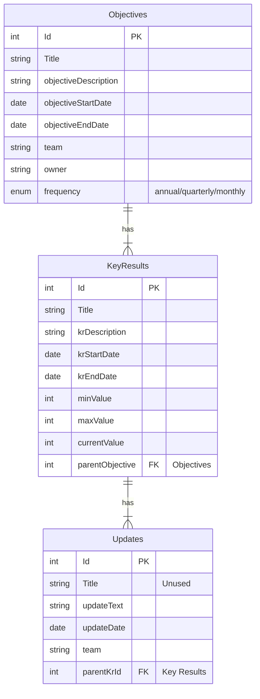

# ROKR
RDO's solution for OKR management in RAiD.

  
  
  

## Value Proposition
OKRs are tough to manage without tools, especially on the internal IT environment. We designed an approach (Stack 2.0) to fully leverage internal tools and designed **ROKR** as the first app built on Stack 2.0 to enable RAiD to implement OKRs.

## Entity-Relationship Diagram

## Upcoming Features
- [ ] Delete Objective
- [ ] Delete KR

## Notes
- For [`vis.js`](https://visjs.org/) network graphs, simply creating a graph on a given route will produce an error when you navigate to a different route and then return to that route. The error states that a given node with a duplicate ID already exists, even though you're creating a new Network Object. This is because React Router modifies the DOM when navigation occurs **without dismounting components in the current route**. A graph that has not been destroyed is still registered with `vis.js`, but its DOM element has disappeared. React Router v6.3.0 provides no way to force-dismount components, which means the useEffect return function is not feasible for destroying the graph before navigation occurs. The workaround is to:
    1. Create a Context that holds state at the App level, which is above all routes.
    2. In the Directory (or route that contains the graph), set the context (i.e. App.js state) to the `vis.js` Network object after the object is created. Since state is held at the App level, navigation managed by React Router cannot remove this object, and you can still access it via Context.
    3. In the Directory, **before** creating a fresh Network object, retrieve the **old Network object** and call the destroy method to get rid of it. The effect: after navigating away and back to the Directory, the old Network object is fully removed.