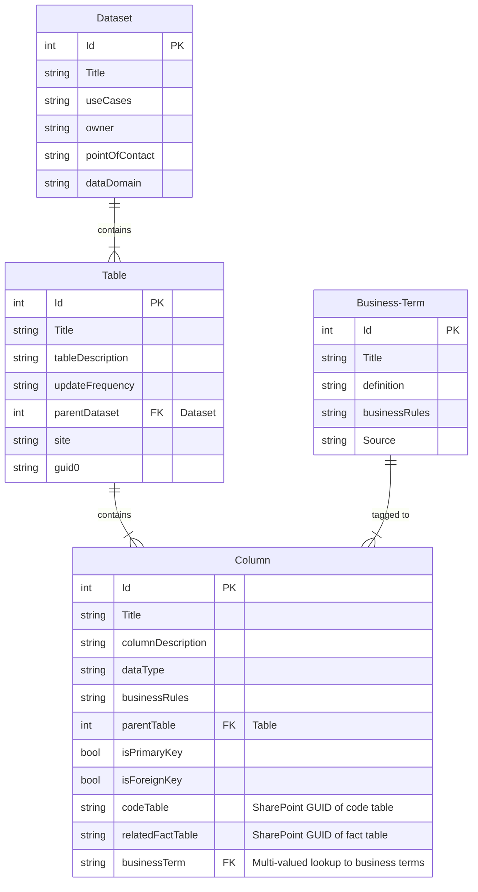

# ROKR
RDO's solution for the AF's OKR management application.

  
  
  

## Value Proposition
OKRs are tough to manage without tools, especially on the internal IT environment. We designed an approach (Stack 2.0) to fully leverage internal tools and designed **ROKR** to enable RAiD to implement OKRs.

## Entity-Relationship Diagram

