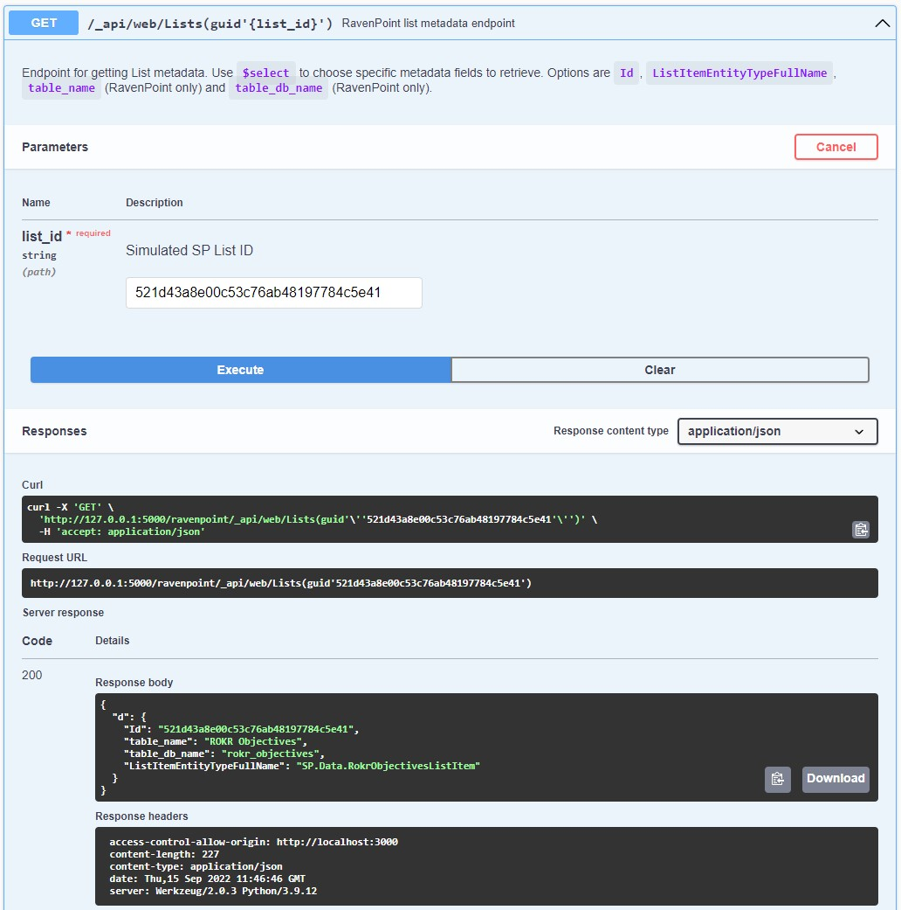

# ROKR
RDO's solution for OKR management in RAiD.

<p>
  
  
  
</p>

## Value Proposition
OKRs are tough to manage without tools, especially on the internal IT environment. We designed an approach (Stack 2.0) to fully leverage internal tools and designed **ROKR** as the first app built on Stack 2.0 to enable RAiD to implement OKRs.

## Installation
First, you'll need RavenPoint, a SharePoint REST API emulator that ROKR uses as its backend. See the [RavenPoint repo](https://github.com/chrischow/ravenpoint) for instructions on installation. For the creation of fake data, modify the `rokr_demo_data.py` script to create your own fake data. Be sure to take note of the teams you used for generating the fake data.

Second, in a separate terminal window, clone this repo (ROKR) to a local directory, `cd` into the `dev` folder, and install the required packages:

```bash
npm install
```

Next, configure ROKR to retrieve data from the right tables. Proper configuration requires that you amend several entries in `src/config.js`:

1. List IDs: `objListId`, `krListId`, `updateListId`
2. List Item Entity Type names: `objListItemEntityTypeFullName`, `krListItemEntityTypeFullName`, `updateListItemEntityTypeFullName`
3. Teams

After creating the Objectives, Key Results, and Updates tables, enter the RavenPoint admin panel to retrieve the relevant Table IDs:


The List Item Entity Type names can be retrieved via the RavenPoint Swagger UI. You will need to feed each List ID into the `/_api/web/Lists(guid'<list id here>')` endpoint:



The teams should have the same team name and slug that you used to generate the fake data.

Once all the above steps are completed, while still in the `dev` folder, launch ROKR in development mode:

```bash
npm start
```

ROKR should now be running on `http://localhost:3000/`.

## Gallery
Home page:


Team page:


Directory:

