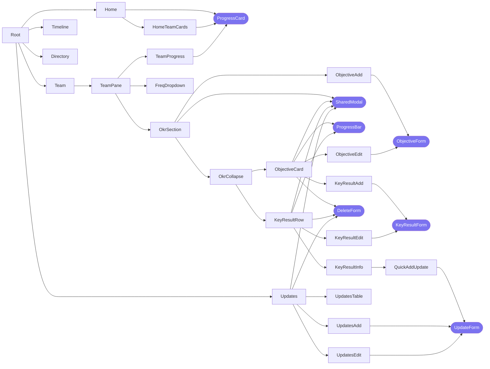

# ROKR Developer Guide
Read this doc for details on the app structure.

The folder structure reflects this dependency tree. Top-level components are in TitleCase. All other supporting elements are in lowercase.

In the diagrams below, each folder contains `index.js`, and sometimes, also `styles.css`. We omit these files from the diagram for simplicity.



## A. Top-Level Components

### 1. `Home`
This component contains the progress cards for the main organisational entity and its sub-entities. The component tree:

```
Home
└── HomeTeamCards
```

The `HomeTeamCards` component creates a list of card elements. Each card wraps a [`ProgressCard` shared component](#components), which has a progress ring for average Objective progress, and the counts of completed/total Objectives and KRs.

### 2. `Team`
This is the main component containing the bulk of components in ROKR. For ease of viewing, the explanations for the components are split into two tables, and described in a breadth-first manner.

| Component | Purpose |
| :-------- | :------ |
| `Team` | Contains three Tab panels, one for each frequency (monthly, quarterly, annual). Queries the team's Objectives, KRs, and Updates and passes it into each Tab panel. |
| `TeamPane` | Contains the Tabs for staff (monthly frequency only), and a time period selector (`FreqDropdown`). Filters the data provided in props using the chosen staff and period, and passes the data down to the child components. |
| `FreqDropdown` | Dynamic dropdown menu for monthly, quarterly, or annual time periods in the dataset. |
| `TeamProgress` | Basically a `ProgressCard` shared component, the same one on the top of the `Home` page. |
| `OkrSection` | Joins the data to create `OkrCollapse` components. Handles the creation of Objectives through a `SharedModal` shared component. Auto-populates new Objective forms with the currently selected team, frequency, time period, and staff (if applicable). |
| `ObjectiveAdd` | Wrapper for `ObjectiveForm` to render it in add mode. Defines functions to (1) invalidate and refetch data, and (2) clean up the form. |

```
Team
└── TeamPane
    ├── FreqDropdown
    ├── TeamProgress
    └── OkrSection
        ├── ObjectiveAdd
        ├── ObjectiveForm
        └── OkrCollapse (See table below)
            ├── ProgressBar
            ├── ObjectiveCard
            │   ├── ObjectiveEdit
            │   └── KeyResultAdd
            ├── KeyResultRow
            │   ├── KeyResultInfo
            │   ├── KeyResultEdit
            │   └── QuickAddUpdate
            └── KeyResultForm
 
```

| Component | Purpose |
| :-------- | :------ |
| `OkrCollapse` | Wraps one `ObjectiveCard` and several `KeyResultRow`s. |
| `ObjectiveCard` | Displays Objective info through text and a `ProgressBar`. Handles the editing & deleting of Objectives and adding of KRs through `SharedModal`s. Auto-populates new KR forms with current Objective and selected time period. |
| `KeyResultRow` | Displays KR info through text and a `ProgressBar`. Handles the viewing, editing, and deleting of KRs through `SharedModal`s. |
| `ObjectiveEdit` | Wrapper for `ObjectiveForm` to render it in edit mode. Defines functions to (1) invalidate and refetch data, and (2) clean up the form. |
| `KeyResultAdd` | Wrapper for `KeyResultForm` to render it in add mode. Defines functions to (1) invalidate and refetch data, and (2) clean up the form. |
| `KeyResultInfo` | Displays detailed KR info and lists Updates in a DataTable. Also links to the associated `Updates` view (top-level component), and contains a form to quickly add updates. |
| `KeyResultEdit` | Wrapper for `KeyResultForm` to render it in edit mode. Defines functions to (1) invalidate and refetch data, and (2) clean up the form. |
| `QuickAddUpdate` | Wrapper for `UpdateForm` to render it in add mode. Defines functions to (1) invalidate and refetch data, and (2) clean up the form. |

### 3. `Updates`
The main `Updates` component manages the data and holds the states for the add and edit form for Updates of a given KR. It

```
Updates
├── UpdateAdd
├── UpdateEdit
└── UpdatesTable
```

| Component | Purpose |
| :-------- | :------ |
| `KeyResultAdd` | Wrapper for `UpdateForm` to render it in add mode. Defines functions to (1) invalidate and refetch data, and (2) clean up the form. |
| `ObjectiveEdit` | Wrapper for `UpdateForm` to render it in edit mode. Defines functions to (1) invalidate and refetch data, and (2) clean up the form. |
| `UpdatesTable` | DataTable for displaying Updates. Contains buttons to edit each Update. |

### 4. `Timeline`
Contains a single DataTable comprising all Updates. It pulls all Objectives, Key Results, and Updates - this can be improved.

### 5. `Directory`
In addition to the components below, the main `Directory` component has a panel to display OKR information.

```
Directory
├── SearchBar
├── Graph
└── useGraphSettings (hook)
```

| Component | Purpose |
| :-------- | :------ |
| `SearchBar` | Search bar for user to search for OKRs, which will be highlighted in the `Graph`. |
| `Graph` | An interactive network graph for displaying OKRs. |
| `useGraphSettings` | Hook to generate graph settings. |

## B. `shared`
This folder comprises components that are shared across 2 or more top-level components.

### Components

| Component | Purpose |
| :-------- | :------ |
| `Icons` | SVG objects in component and string constant form. Helps save memory. Used in numerous components. |
| `NavBarBrand` | Blue and green ROKR text. Has two sizes: one for NavBar, one for Home. |
| `NavBar` | Doesn't fit under any top-level component, but displays on top of every page. |
| `ProgressCard` | Progress ring with average Objective progress, and counts of completed vs. total Objectives and KRs. Used in `Home` and `Team` components. |
| `SharedModal` | Modal with configurable title, content, and closing behaviour. Controlled by state in parent component. Used in `Home` and `Updates` components. |
| `ProgressBar` | Has two variants: one for Objectives and one for KRs. |
| `ObjectiveForm` | Controlled form for adding and editing Objectives. Includes validation, submission, and a link to `DeleteForm`. Component is held at this level because it is used in multiple components within `Team`: (1) `ObjectiveAdd` and (2) `ObjectiveEdit`. |
| `KeyResultForm` | Controlled form for adding and editing Key Results. Includes validation, submission, and a link to `DeleteForm`. Component is held at this level because it is used in multiple components within `Team`: (1) `KeyResultAdd` and (2) `KeyResultEdit`. |
| `UpdateForm` | Controlled form for adding and editing Updates. Includes validation, submission, and a link to `DeleteForm`. Used in `Home` and `Updates` components. |
| `DeleteForm` | Form for delete entities using an `ON DELETE CASCADE` rule. Presents warning if cascading is required. Used in `Home` and `Updates` components. |

### Hooks
Data is retrieved and managed using [React Query](https://react-query-v3.tanstack.com/overview).

| Hook(s) | Usage |
| :------ | :---- |
| `useObjectives`, `useKeyResults`, `useUpdates` | Retrieve all data for `Timeline`. |
| `useObjectivesByFreq('annual')`, `useObjectivesByFreq('annual')` | Retrieve annual data for `Home` and `Directory`. |
| `useTeamObjectives(<team>)`, `useTeamKeyResults(<team>)`, `useTeamUpdates(<team>)` | Retrieve team data for `Team`. |
| `useKeyResult(<krId>)`, `useKrUpdatesDirect(<krId>)` | Retrieve info on a KR and its associated Updates for `Updates`. |

#### 1. `useObjectives`
For retrieving Objectives. There are multiple hooks:

- `useObjectives()`: Retrieves **all** Objectives in the database. It has several dependent hooks:
    - `useObjective(Id)`: Retrieves Objective with a given Id using data from `useObjectives`.
    - `useTeamObjectivesCache(team)`: Retrieves Objectives under a given team using data from `useObjectives`.
- `useObjectivesByFreq(freq)`: Retrieves Objectives with a given frequency only.
- `useTeamObjectives(team)`: Retrieves Objectives under a given team only.

#### 2. `useKeyResults`
For retrieving KRs. There are multiple hooks:

- `useKeyResults()`: Retrieves **all** KRs in the database. It has several dependent hooks:
    - `useKeyResult(Id)`: Retrieves KR with a given Id using data from `useKeyResults`.
    - `useTeamKeyResultsCache(team)`: Retrieves KRs under a given team using data from `useKeyResults`.
- `useKeyResultsByFreq(freq)`: Retrieves KRs with a given frequency only.
- `useTeamKeyResults(team)`: Retrieves KRs under a given team only.

#### 3. `useUpdates`
For retrieving Updates. There are multiple hooks:

- `useUpdates()`: Retrieves **all** Updates in the database. It has several dependent hooks:
    - `useUpdate(Id)`: Retrieves Update with a given Id using data from `useUpdates`.
    - `useKrUpdate(krId)`: Retrieves Updates under a given KR using data from `useUpdates`.
- `useKrUpdatesDirect(KrId)`: Retrieves Updates under a given KR only.
- `useTeamUpdates(team)`: Retrieves Updates under a given team only.

#### 4. `useToken`
For getting X-RequestDigest for SharePoint POST requests. Has a single `useToken` hook.


## C. Supporting Elements

### `assets`


### `utils`