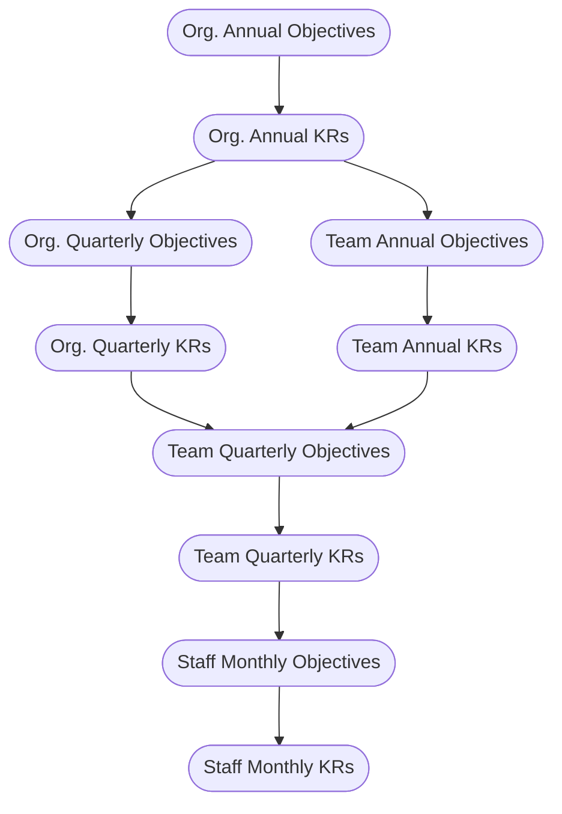

# Future Dev
This document contains ideas on future development work for ROKR. The current developer direction is to implement ROKR as a series of graphs.

Following the introduction of the network graph as the new `Directory`, we note that OKRs can be much better displayed as a series of interconnected nodes. This type of visual provides a more holistic overview of the efforts of the entire outfit, while providing the option for users to zoom in on the specific OKRs that they want to view.

This is just a theory. We will need to gather user feedback before embarking on this.

## Network Graphs as the Main Display
Instead of having a collection of collapsibles (`OkrCollapse` components) for each team's OKRs, everything could be a graph. The detail panel can incorporate the features currently in the `OkrCollapse` component: adding, editing, and deleting of Objectives and Key Results, and the viewing and adding of Updates. Features to edit and delete Updates can be added in.

### Combined Views: Annual and Quarterly OKRs
All teams' annual and quarterly OKRs can be displayed as a network graph. One option is for annual OKRs to be on one graph, and quarterly OKRs to be on another. Another option is for all of them to be on a single graph. The former is cleaner, while the latter can be used as a check that all annual OKRs are being worked on.

### Team View
The same two options apply for a team: (1) monthly OKRs as separate graphs, or (2) quarterly and monthly OKRs in a single graph. The latter runs the risk of containing too much information, because it would contain three months' worth of OKRs.

## More Interconnected Data Structure
Currently, Objectives are the top-level entity. Instead, we could have a hierarchy of entities:

This way, each entity is created in some context (except the root: annual Objectives).